Areas and Volumes

# Common shape areas
We rarely measure areas directly.  For example, there is no tape measure
that has an area.

## Rectangle
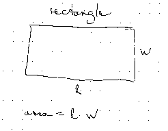

## Circle
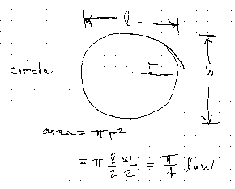

## Ellipse
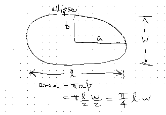

## Any shape
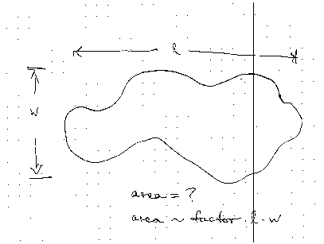

## Areas
- Notice that these all involve the length and the width and a factor

| shape     |  area             |
|-----------|-------------------|
| rectangle | $$l \cdot w$$       |
| circle    | $$0.79\ l \cdot w$$ |
| ellipse   | $$0.79\ l \cdot w$$ |

## Area
- Has dimension of length squared

# Common Shape Volumes

## Basic Volumes
- Cube
- Cylinder
- Pyramid
- Sphere

## What is in common?
- A length times a length times a length
- Has dimensions of length cubed
- Volume only differs from a rectangular prism by a factor

## Cylinder
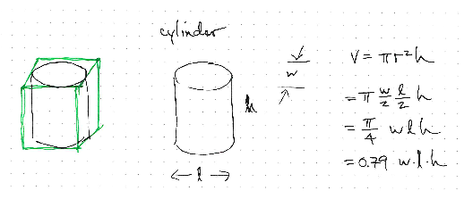

## Sphere
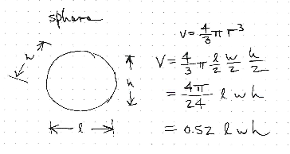

# Unit Conversion

## Converting areas

A common source of area is forgetting to apply a linear conversion twice
to get an area conversion.

$$ 1 m^2 = 1 \cdot meter \cdot meter $$

$$ 1 \cdot meter \cdot meter \cdot \frac{100cm}{meter}  \cdot \frac{100cm}{meter} = 10^4 cm^2$$

## Converting volumes
$$ 1 m^3 \cdot \frac{100cm}{m}  \cdot \frac{100cm}{m}  \cdot \frac{100cm}{m} = 10^6 cm^3$$
$$ 1 m^3 \cdot \left( \frac{100cm}{m} \right)^3 = 1m^3 \cdot \frac{10^6 cm^3}{m^3} = 10^6 cm^3 $$

## Converting volumes
- How many cubic inches in a cubic foot?

## Converting volumes
- Convert cubic meters to liters

# Roots

Roots answer the question, what is the size of square or cube that I can
fit a given quantity in?

## Square roots
- If I have a certain area, how do I find the square that contains that
  area?

## Square Roots
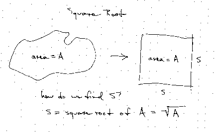

## Cube roots
- If I have a volume, how do I find the cube that contains that volume?

## Cube Roots
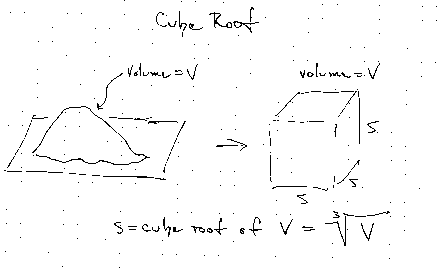

# Examples

## GPA

The calculation of a grade point average can be thought of as an area
problem.

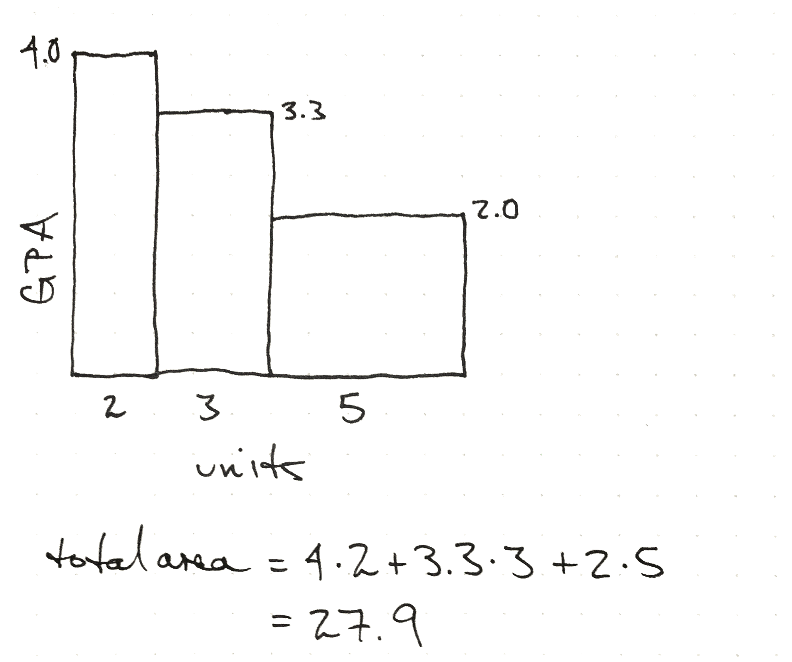

The average is the height of a rectangle that is 10 units long, or 2.79.

## River flow

We can estimate the flow of a creek if we know the rate of rainfall and
the land area that drains into the creek.

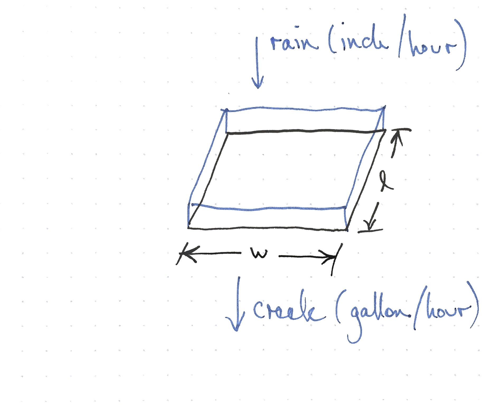

## Average Power

If we have a power that is changing over time, we can interpret the area
under the curve as an energy.  The average power is the height of a
rectangle with the equal width and area.

# Area as a way of understanding formulas

## Pythagorean theorem

$$ a^2 + b^2 = c^2 $$

- We usually interpret as a relation between the sides of a right
  triangle
- We can also interpret as a statement about the areas

## Pythagorean theorem
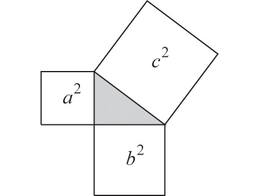
- Strogatz, The Joy of X

## Pythagorean theorem
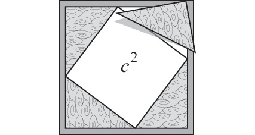
- Strogatz, The Joy of X

## Pythagorean theorem
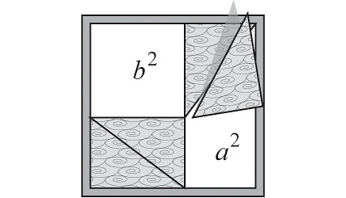
- Strogatz, The Joy of X

## Quadratic theorem as an area
- Blends algebra and areas

$$ \frac{-b \pm \sqrt{b^2 - 4ac}}{2a} $$

## Completing the square

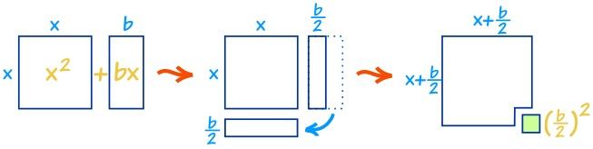

- www.mathisfun.com

<!--
this relationship between formulas and areas is what i find interesting
-->

# Activities

## Estimations
- What is the area of skin on the human body?
- Without looking, how much volume in a can of soda?
- How much water in your water bottle?
- What is the volume of the aluminum?
- How much does an empty can weigh?

## Exercise
- Estimate the area of our classroom
- Using units of your stride squared
- Using the floor tiles
- Convert between square strides and square feet

## ETC Area
- Estimate the volume of our classroom

## Question
- I have a coupon for 1000 square feet of carpet.
- What is the largest square room I can cover?

## Creek Flow Estimation
- Make a model of the flow
    - What are your assumptions?
    - Is all the water flowing at same speed?
    - What is the basic depth and shape of the creek bed?
- Estimated the flow of the creek in volume per time
- Estimate the linear speed of flow
- Estimate the volume per time
- Where is the water coming from?
