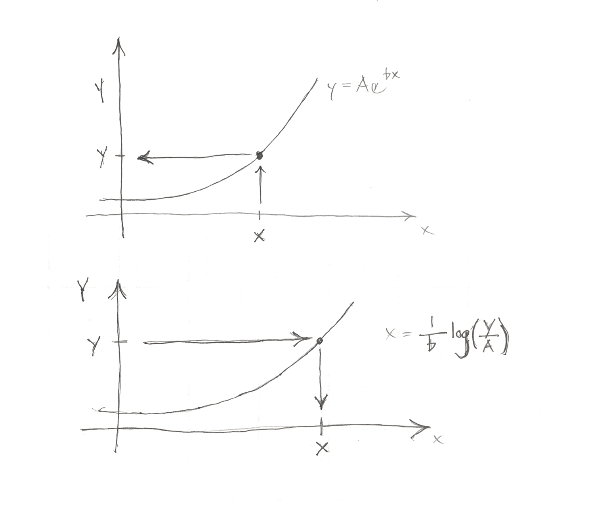

# Exponential Computations

# Forward

Often an exponential is used to represent a population or an amount of something.

If we want to find the amount or population at a certain time or other independent variable, we substitute our variables and compute the amount.

$$
population = P_0 e^{at}
$$

- $$P_0$$ is the population when $$t=0$$.
- $$a$$ tells us how fast the population is growing.
- $$t$$ is the time.
- We have to be certain that the units for $$a$$ and $$t$$ match.

# Inverse or Logarithm

If we want to find the time at which a population reaches a certain number (dependent variable), we must use the inverse of the exponential.
This inverse is the logarithm.

# Brute force inverse

To find the inverse, you can also guess and adjust your number for the independent variable until you match the dependent variable.

# Graphical Explanation

To go up and to the left, we use the exponent.

To go right and down, we are using the inverse.

# Inverting a Logarithm

You may have the equation below and want to find t.

$$y=A e^{b\cdot t}$$

Your strategy is to manipulate the equation so that you can use the inverse.

$$\frac{y}{A} = e^{b \cdot t}$$

At this point we can take the logarithm of both sides since the logarithm is the inverse of the exponential function.

$$ \log(y/A) = log(e^{b \cdot t}) = b \cdot t$$

$$ t = \frac{\log(y/A)}{b}$$

# Computation

Note that the natural log is used to invert $e^x$, while the base 10 log is used to invert $10^x$.

On calculators and computers, the natural log is referred to as `ln` or `log` while the base 10 log is referred to as `log` or `log10`.

Be sure you have tested your functions and know which one to use.

