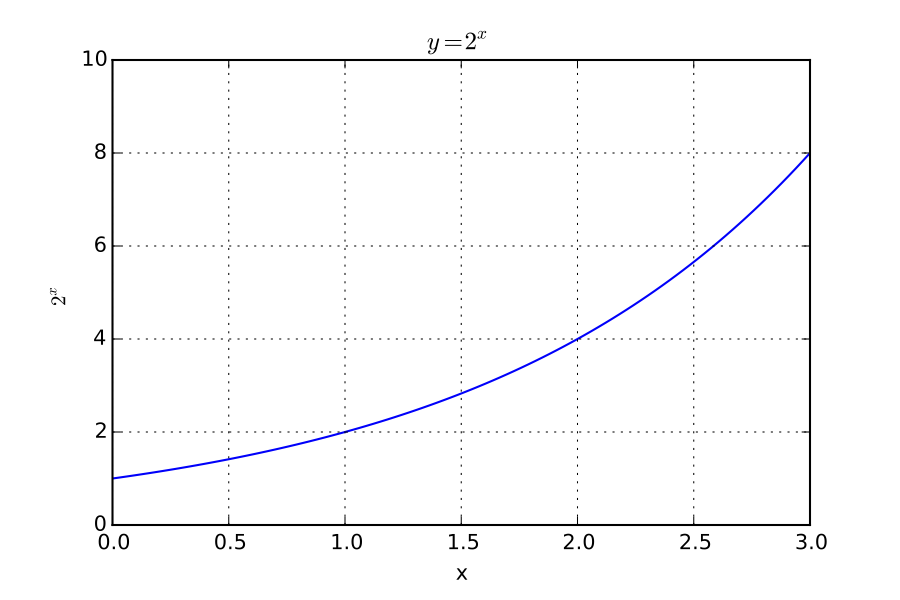
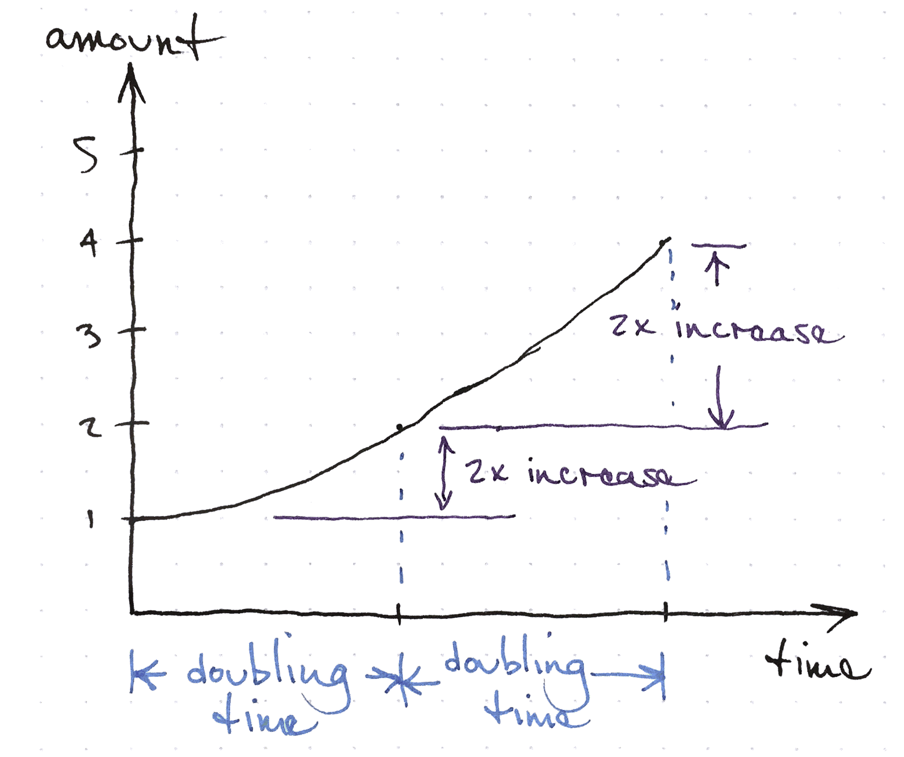
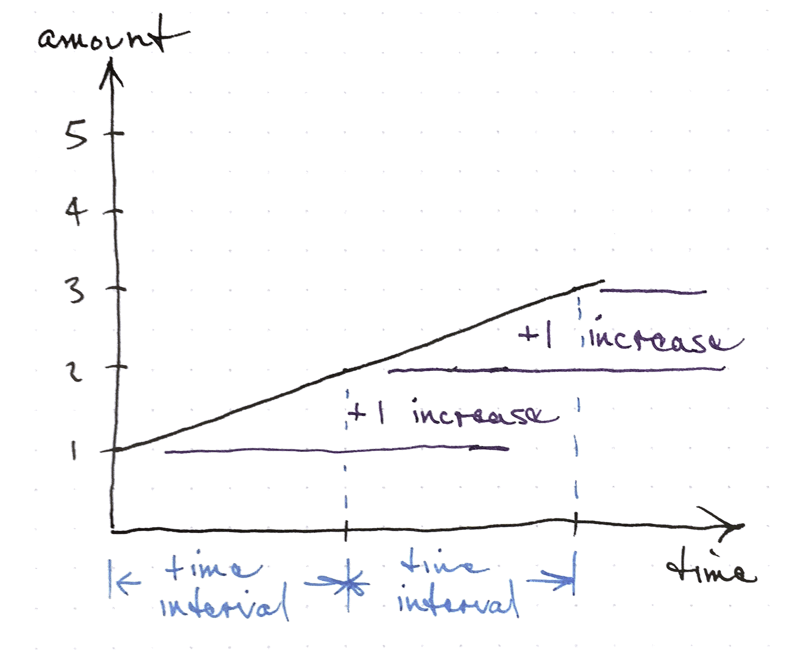
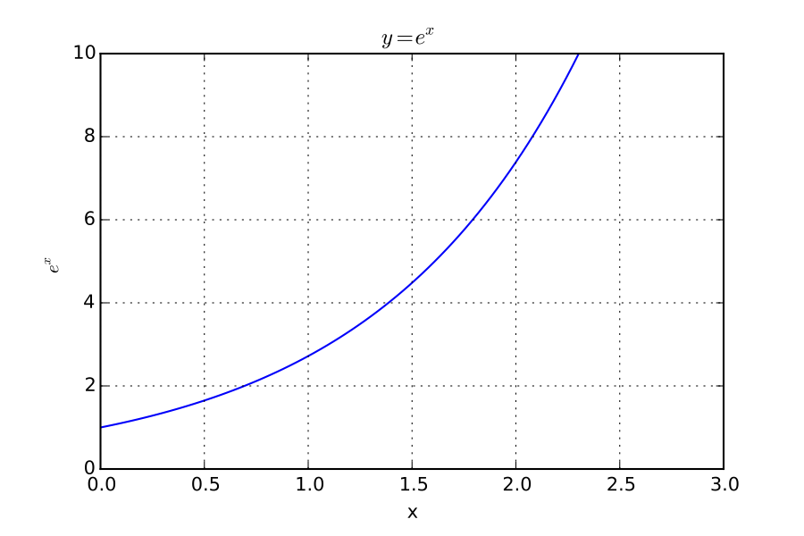
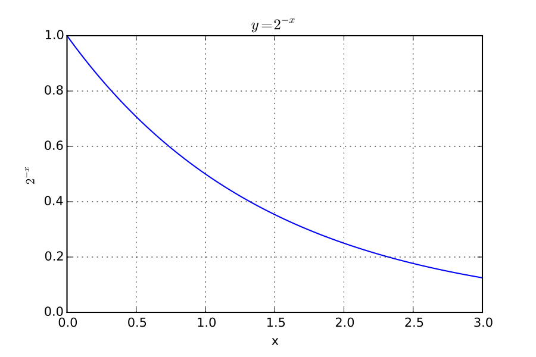
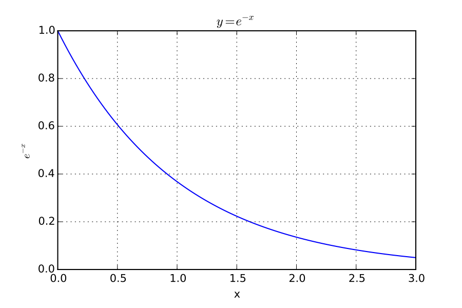

# Exponential

The word exponential makes this concept sound unnecessarily difficult.

A simple definition is that exponential models arise when the change in a quantity is proportional to the amount of the quantity.
That is, the slope of an exponential function at any point is equal to the value of the function at any point multiplied by a number.

If a function is exponential, the relative difference between any two evenly spaced values is the same, anywhere on the graph.
This is similar to linear functions where the absolute difference between any two values separated by the same x-axis distance is the same.

If you plot something on a log axis, you will notice that the distance between any two numbers with the same ratio is the equal.
This preservation of the size of a ratio is the key feature of logarithms and exponentials.

<!-- do I have an good illustration of this already? -->

# Examples

## Folding paper
- Zero folds $$2^0$$ makes one sheet thick
- One fold $$2^1$$ is two sheets thick
- How many times can you fold?
- How can we express the number of pages by the number of folds?
- Can we write out the pattern?

<!-- my max is six -->

$$ \textrm{pages} = 2^{\textrm{folds}} $$

## Rabbits
- start with two
- wait one year
- now we have double (4)
- wait another year
- now we have eight (8)
- how many in 5 years?

The number of rabbits at the start of the generation (starting with
generation zero) is
$$ \textrm{rabbits} = 2^{\textrm{generations+1}} $$

## Money grows the same way
- Start with $1000
- Grow by 10%
- Now $1100
- Grow by 10%
- Now $1210

$$ 1000 \cdot (1+0.10)^{years} $$

## Exponential growth
- The rate of change is proportional to the total number
- The doubling time is constant over the entire range
- What things exhibit these characteristics?

## Exponential growth
- Populations
- Disease spread
- Credit card balances
- Viruses

# Definitions

## Doubling

## Doubling Time

Exponential growth means that if you measure how long it takes a
quantity to double, the time to double from any current amount will be
the same.

<!-- feels like clumsy phrasing -->

## Constant Growth

This is in contrast to linear growth where if you wait for the amount to
increase by a fixed amount, the amount will always increase by that
fixed amount in that amount of time.

For linear growth, the slope of the function is a number that does not change along the function.

## Which gets bigger faster?
$$x^2$$ or $$2^x$$

Draw these out in your notebook to see

<!-- note you are moving the x from the base to the exponent -->

## Exponential growth

## Exponential Decay
What if instead of doubling every year, something fell by half each
year?

<!-- tear a piece of paper in half repeatedly -->

## Halving

## Exponential Decay

## Exponential decay
- A quantity loses the same fraction of itself for a given time interval
- Nuclear waste
- Toxins in a body
- The water in a stream (baseflow)

# Logarithm

## Inverse functions
- Recall that the square root and the cube root were the inverse of the squared function and the cube function

## Logarithm
- The inverse of exponentiation is the logarithm
- Properties of $e$
- You have to specify your base on a computer (2, e, 10)

## Logarithm
- Inverse of exponential function
- If $$y = 10^x$$ then $$\log y = x$$
- If $$y = e^x$$ then $$\ln y = x$$
- For any other number (called the base, $$b$$):
    - If $$y = b^x$$ then $$\log_b y = x$$

## Logarithm
The logarithm in base 10 basically asks, if you are in base 10, how many digits?

## Logarithmic scales
- Musical pitch
- Richter scale
- Vision
- Sound

In each of these, we perceive or use the logarithm.

## This rule is a consequence of logarithms
$$ 10^a \cdot 10^b = 10^{a+b} $$

Take log of both sides

$$ a \cdot \log 10 + b \cdot \log 10 = (a+b) \cdot \log 10 $$

# Solving Problems

## Analytical Approach

Use the logarithm as an inverse function.

$$ y = \beta e^x $$
$$ \log {y/\beta} = \log{e^x} $$
$$ \log {y/\beta} = x $$

## Brute force approach

If you know y and $$\beta$$ you can try different values for x until you
come close to the value for y.

$$ y = \beta e^x $$

# Miscellaneous Stuff

# Unexpected connections

The number e and the natural logarithm are connected in various places
to other mathematical numbers in fascinating ways.

The natural logarithm is the area under the 1/x curve

## Definitions of e

$$ e = \lim_{n \to \infty} (1 + 1/n)^n $$

$$ e = 1 + 1 + \frac{1}{2 \cdot 1} +  \frac{1}{3 \cdot 2 \cdot 1}  +  \frac{1}{4 \cdot 3
\cdot 2 \cdot 1} + \cdots $$

## Euler

$$ e^{i \theta} = \cos \theta + i \sin \theta $$

$$ e^{i \pi} + 1 = 0 $$

where $$i = \sqrt{-1}$$

## Calculation examples

- Most scripting languages and calculators use the `^` symbol for
    exponents.  `2^2 = 4`.
- Python uses `**` for exponentiation.  `2**2 = 4`
- Some computer programs use `log` to mean the natural logarithm, not
    the base 10 logarithm.  Check carefully and see what your tool uses.
- If you type `log(10)` and get 2.3 you are not using base 10.

<!-- flipping equations -->

# Advanced Topics

I call these advanced topics mainly because the notation we use to
express them is intimidating.  The ideas behind them are simple and are
unnecessarily obscured by our notation.

## Differential equation

$$ \frac{dP}{dt} = rP $$

- P is the population
- r is the rate of growth

Any equation where the change is proportional to the population is
exponential growth

This relates to our earlier definitions where the percent change is
constant for a given time interval.

<!-- draw out some rise over run graphs -->

## Differential equation

$$ \frac{dP}{dt} = \textrm{constant} $$

Linear growth has the changes is constant

## Logistic function

Here the rate of change decreases as the population gets very large

This gives an s-shaped function.

You can see an example of this curve in the gangham style video
statistics on youtube.

## Time constant

This number expresses the time it takes for an exponential function to
increase by a certain fraction.

$$ e^{t/\tau} $$
