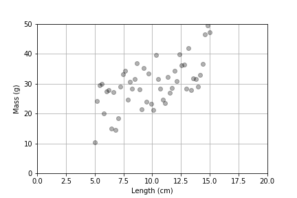

# Linear Models with Gaussian Noise

Here we combine our linear model with uncertainty.
Even though data may not fall on a perfect line, we can uncover an underlying linear relationship even if the data have a lot of variation.

Before we have taken a population and broken it into two samples and looked for differences between the distributions.
These concepts and techniques allow us to take a population and sort it according to a variable and see how the distribution varies.

<!--  -->

# Questions

By finding the underlying slope in the data, we can ask what is the average change in a measurement based on a change in the other measurement.

By measuring the variation in the data around that line, we can ask how much of the measurement is explained by the linear relationship and how much of the measurement can't be explained yet.

# Definitions

## Independent Variable

This is the variable that we can "control" in an experiment or study.

## Dependent Variable

This is the variable that measures the outcome in our experiment or study.

## Linear Regression

The mathematical technique used to determine the linear model that "best" fits a set of data.

