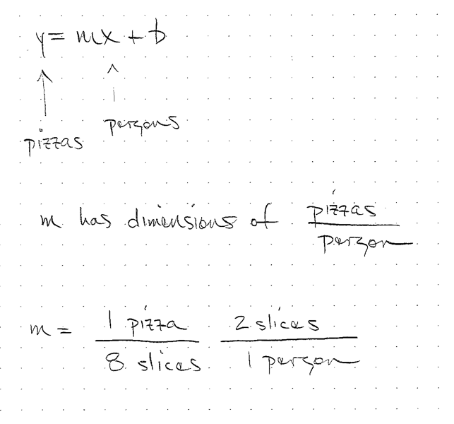
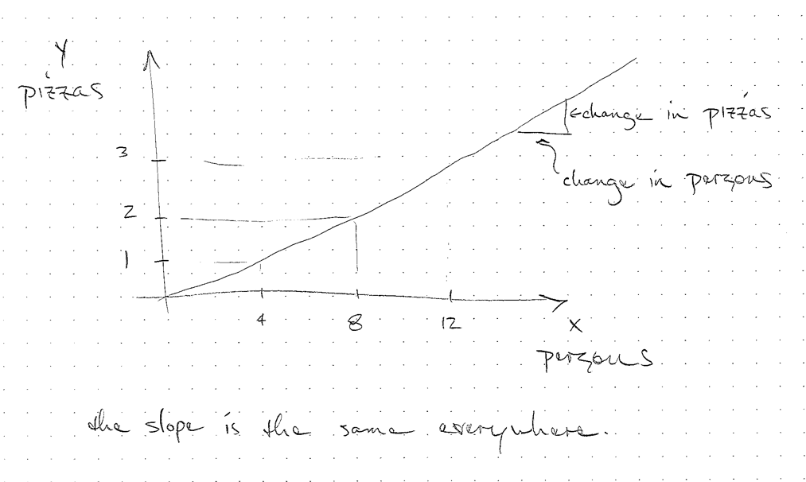
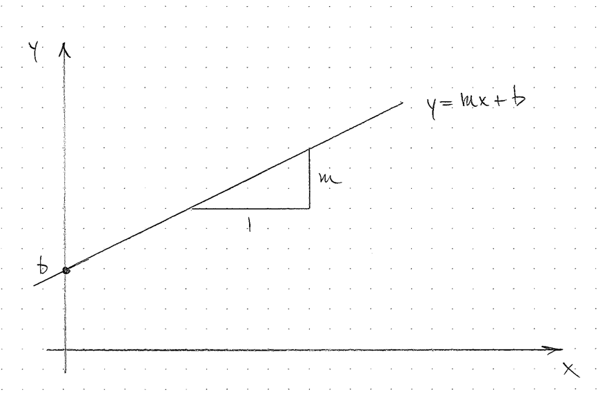

# Linear Functions Introduction

Many of our questions and estimations can be determined by linear relationships.

A linear relationship means that for a given change anywhere in the independent variable (x-axis) there is the same change in the independent variable.  
This is equivalent to saying the slope is the same anywhere in the relationship.

Linear relationships are defined by a straight line when graphed and allow easy prediction.

# Concepts

- Independent variable
- Dependent variable
- Slope
- Proportional Relationship

## Independent Variable

- The variable we can manipulate
- The variable we want to see the effect of changing
- Placed on the x-axis

## Dependent Variable

- The variable we observe when we manipulate the independent variable
- Placed on the y-axis

## Slope

This quantity relates a change in the independent variable to the change in the dependent variable.

## Proportional Relationship

- Has a linear relationship
- The independent variable is zero when the dependent variable is zero

# Linear equation
$$ y = mx + b $$

## Estimations

## Estimations

## Linear equation

## Linear equations
- If $$b \neq 0$$ it is a linear function.
- For both, a change in $$x$$ has a change in $$y$$ no matter the value of x.

## Estimations
- The estimations we have used so far have assumed linear models
- We often have a quantity $$x$$ and we have to figure out $$m$$ to get $$y$$.

## Linear Extrapolation

- If we assume a relationship, we can predict its value in the future

## Linear Fits

- If we have a bunch of data that is roughly linear, we can extract a model

## Unit Conversions

- In a unit conversion we can plot the starting units on the x-axis as the dependent variable.
- We can plot the ending units on the y-axis as the independent variable.
- The "unit conversion" is the slope of this line. 

# Details

## Intercepts

- What types of models are likely to have an intercept?
- What models will have an intercept of zero?

# Linear Models

Name some models or phenomenon that exhibit a linear relationship.

- Taxi cab ride
- Pizza price with toppings
- Electricity bill

## Proportion
- If $$b=0$$ we say $$x$$ and $$y$$ are proportional
- Symbol $$\propto$$
- If two things are proportional, the values of the two properties are related by a constant factor
- For the purposes of estimation, we may treat certain things as proportional as an approximation.

## Circle questions
- Is the circumference of a circle is proportional to its radius?
- Is the constant of proportionality the same for all circles?
- Is the area of a circle proportional to its radius?

<!--
no, it is proportional to the radius squared
sometimes we may say it is proportional, but not by the math definition
-->

## Linear relationships
- What other quantities have linear relationships?

## When does proportion and linearity stop being useful?
- What is linear?
- What is not linear?

# Activities

## What is well modeled by linear functions?

## What questions require linear models to answer?

- Brainstorm a list of questions you are interested where the answer
    will be a slope, an intercept, or a linear projection.

## What are examples of linear fits?

## What have we already covered that are linear relationships?

- Unit conversion
- Estimations
