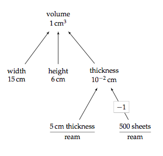

# Models

We will learn how to create simple models that enable us to gain insight
into the problem we are investigating.

- A simplified representation of a problem we'd like to solve
- A model is an approximation that allows us to think about the world
- Models:
    - rectangle
    - linear increase or decrease
    - exponential increase or decrease
    - a roll of a die or several dice
    - a bathtub with a faucet and a drain
- The situation you are modeling won't always look exactly like the
    model
- All models are wrong, some are useful
- Can you think of an example of a model?
- Models often contain assumptions about the problem that others may not
    share

## Estimations and models
- Understand the problem
- Take a guess
- Identify the most important quantities
- Estimate the value of these quantities
- Set up the computation as clearly as possible
- Execute the computation
- Decide if the result is plausible
- See if it matches your original guess

## Models
- We have been using models
- We have modeled each person as eating exactly the same number of
slices
- Most models assume that a real world problem will behave like a
mathematical function
- Models are normative and make assumptions about the world
- Modeling is the important mathematical literacy we are developing

## Future topics

- Quantities, dimensions, and units
- Scientific notation for representing large numbers
- Using computers to ensure reliable computation

# More complex models

In the Art of Insight, Sanjoy Mahajan presents ways of determining what
estimations you need to make in your model.  A useful tool is a tree
model.

This diagram is a tree model to help us determine the volume of a dollar
bill.

Note how we break up our goal estimation into smaller problems and then
work to determine if the smaller problems require further decomposition.

