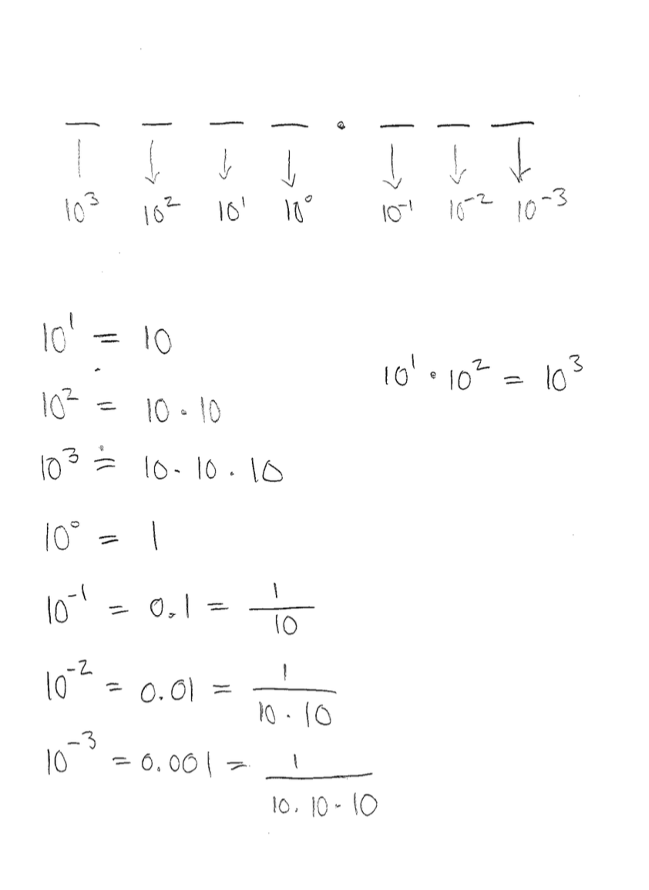
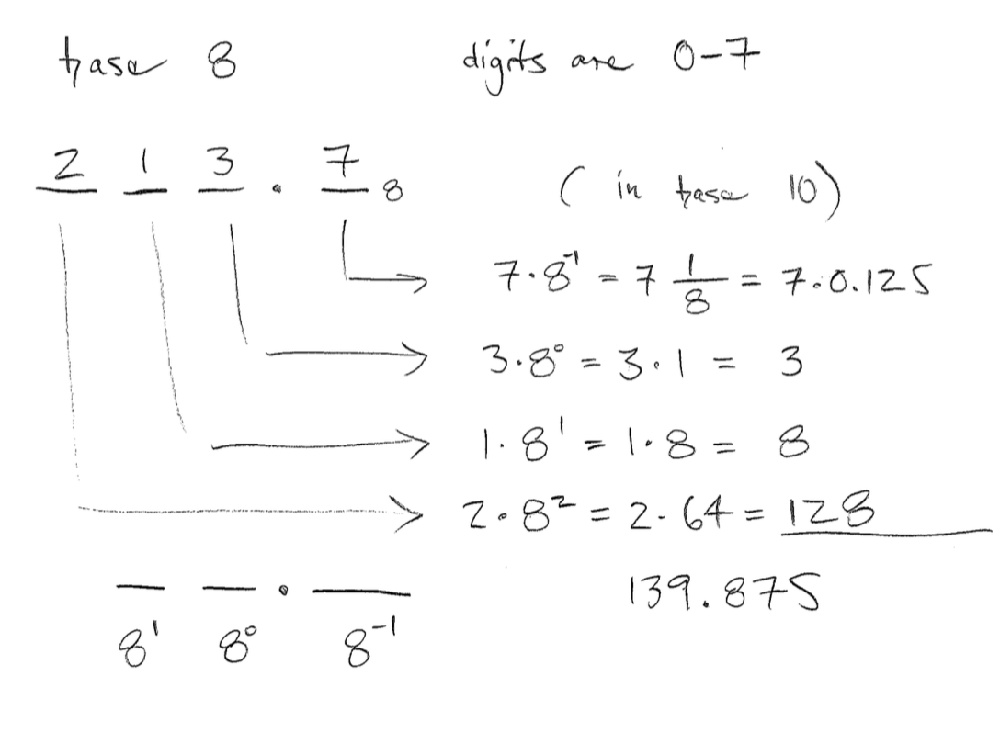
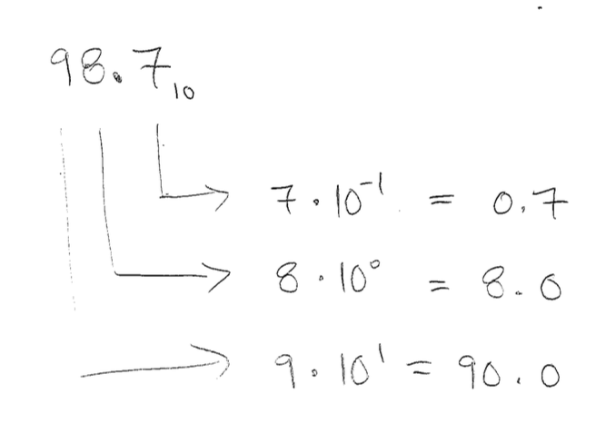
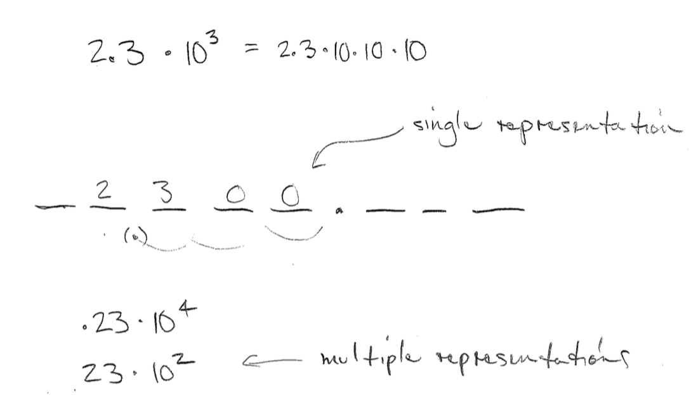

# Place Value

Why can we represent millions of different numbers even though we only
have 10 symbols in the arabic numeral system?  The answer is that the
position of each symbol relative to the other numbers changes its value.

# Early number systems

Early number systems seem reminiscent of a tally system.

- Roman numerals
- Babylonian base 60

## Babylonian Numerals

## Roman Numerals

## The invention of the zero

The invention of the zero was a significant advance in our number
systems.

# Modern Numbers

## Base 10 Place Value Systems

The value of a digit depends on its position relative to our decimal
point.  Notice that although we don't always write the decimal point,
its position is always important.

## Different bases
- We can use any number as the basis of a place-value system
- Computers use base 2 and 16
- These bases provide different representations of the same number

## The number 5

- Here are five dots .....
- We can call this "five"
- Others call it "cinco"
- In decimal we call it "5"
- In binary we call it "101"

## Our Base 10 System

## What if you only have eight fingers?

## Base 8
- $$8^0 = 1$$
- $$8^1 = 8$$
- $$8^2 = 64$$

## Binary representation

A base 2 system is the basis for computer representations of numbers.

The computer performs all calculations in binary and then converts to
decimal.

## Hexadecimal representation

This is a base sixteen representation.  It includes the letters A, B, C,
D, E, and F to represent 10, 11, 12, 13, 14, and 15.

You may see this if you have worked with computer colors for websites or
graphic design.

##

##

##

# Hand Calculation Algorithms

The techniques you learned to add, subtract, multiply, and divide
numbers exploit the place value system.

Imagine multiplication if you had only tally marks or stones as a
representation.  To multiply 5 by 6, you would make five piles of six
stones and then carefully count all 30 stones to arrive at your answer.
Any multiplication resulting in an impractical number of stones would be
beyond your capability.

## Visualization of multiplication areas
See written notes

## Visualization of multiplication algorithms

- Do you understand how these algorithms work?
- Can you see them as a tree model estimation?

## Lattice multiplication

## Division
- Repeated subtraction
- Long division
- Repeated quotients

<!-- graphical display of multiplication squares -->

## Learning Objectives
- Understand the role of place-value in our algorithms

## Multiplication
- Repeated addition
- Place value allows for simple algorithms to compute multiplication
- Traditional multiplication
- Lattice multiplication

# Further reading

- Strogatz, From Fish to Infinity
- Strogatz, Location, Location, Location

# Activities

## Bean representation

