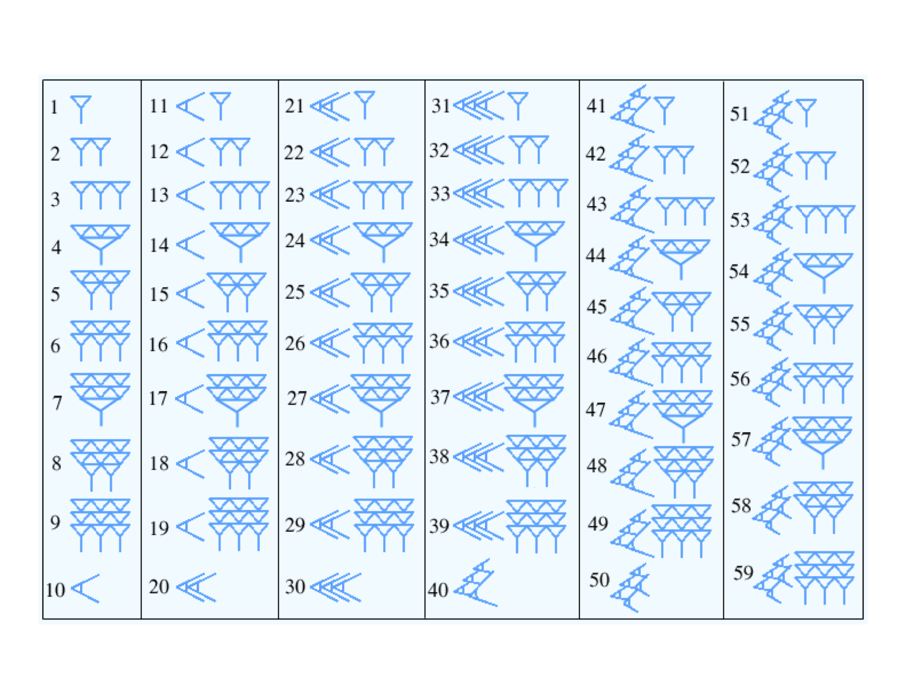
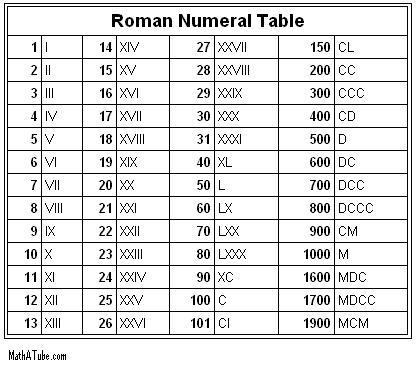
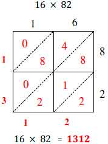

# Place Value

Why can we represent millions of different numbers even though we only
have 10 symbols in the arabic numeral system?  The answer is that the
position of each symbol relative to the other numbers changes its value.

## Different representations of numbers
- Roman numerals
- Babylonian base 60

## Babylonian Numerals

## Roman Numerals

## Beans and dice activity

## Place value
- Written notes

## Different bases
- We can use any number as the basis of a place-value system
- Computers use base 2 and 16

## What if you only have eight fingers?

## Base 8
- $8^0 = 1$
- $8^1 = 8$
- $8^2 = 64$

## Visualization of multiplication areas
See written notes

## Visualization of multiplication algorithms

- See written notes
- Do you understand how these algorithms work?
- Can you see them as a tree model estimation?

## Lattice multiplication

## Division
- Repeated subtraction
- Long division
- Repeated quotients

<!-- graphical display of multiplication squares -->

## Learning Objectives
- Understand the role of place-value in our algorithms

## Multiplication
- Repeated addition
- Place value allows for simple algorithms to compute multiplication
- Traditional multiplication
- Lattice multiplication

## Multiplying and dividing large numbers

$$ 10^a \cdot 10^b = 10^{a+b} $$

$$ c \cdot 10^a \cdot d \cdot 10^b = c \cdot d \cdot 10^{a+b} $$

See written notes

