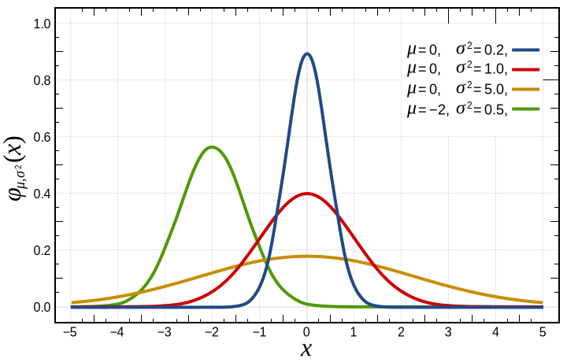

# Probability Distributions and Gaussians

So far, we have focused on single estimates.
How much volume is this tank, how long is this room, etc.
Now we ask questions about several objects at once.

- How tall are the students in this class?
- How big are the classes at my university?
- How big are the departments at my university?

Here we are interested in the behavior of a single variable.
Is it evenly distributed or are some values more present than others?
What are the largest and smallest values?

## Types of Data

- Nominal data has no quantitative value.
    - Examples include countries or genders
- Ordinal data has a number and order isn't continuous
    - Example: survey question 1 for very unsatisfied, 5 for very satisfied
- Quantitative Continuous data has a numerical value and can take any value
    - Example: length, mass, number of people

## Characterizing a body of data

We often ask two questions about data.  The first is what is the central tendency or do the data point to some sort of majority value.  The second is how tightly clustered are the data.  Does the data range widely?

## Mean or Average

A common measure of the central tendency is the mean.
If we take a list of data, sum the values, and divide by the number of data we get the mean or the average.

## Median

Another measure of the central tendency is the median.
The median is the value at which half the data has a value below the median and half the data has a value above it.

## Standard Deviation

The standard deviation is a measure of how dense or spare the data are around the central tendency.

## Histogram

A common tool for looking at single-variable (univariate) data is a histogram.

A histogram

- Shows data of a single quantitative continuous variable
- Shows the value of that data on the x-axis
- Divides the x-axis into evenly spaced bins
- On the y-axis shows the number of values in each bin

## Probability Distribution

A probability distribution is a model that explains the relative probability of different events happening.
The probability distribution is an ideal mathematical model.
The real world doesn't fit it exactly, but the model provides lots of practical power.

The x-axis is the value of a measurement and the y-axis is the relative frequency.

The area under the curve of a (normalized) probability distribution is exactly one.

The probability of a measurement occurring between two intervals is the area under the curve between those two intervals.

These probability distributions are models just like a rectangle or a circle.
This probability distribution is usually a mathematical function.

For example, the gaussian distribution is given by

$$f = \frac{1}{\sqrt{2\pi\sigma^2}}e^{-(x-\mu)^2/\sigma^2}$$

Notice our new friend, the number e, showing up.

## Relative probability

If you can calculate or estimate the area under the curve of a probability distribution, you can predict the probability of an event occurring.

## Percentile

As we ask about the relative probabilities in a distribution, we use the percentile.
The Xth percentile is the value Y at which X percent of the data has a value below Y.
We interpret this as the area below a value on a probability distribution.