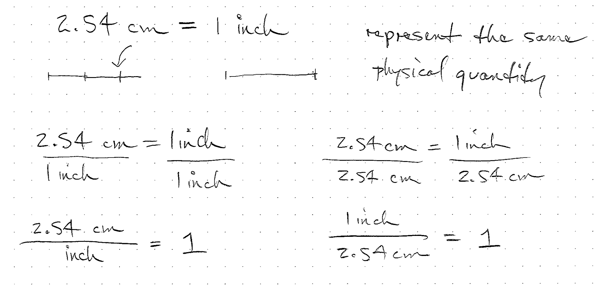
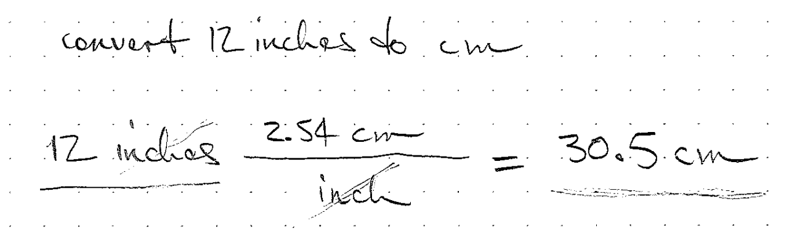
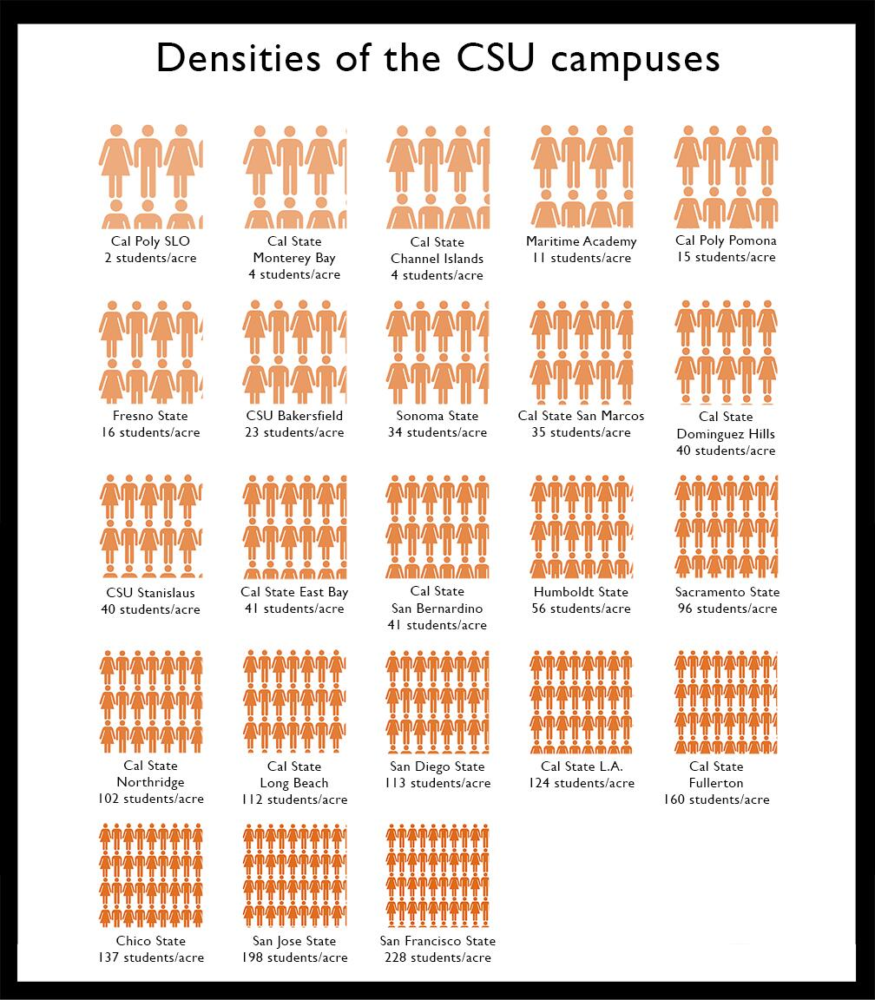
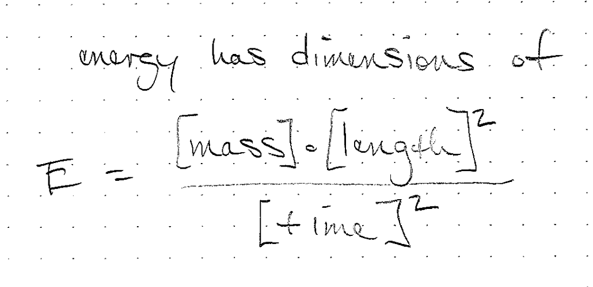
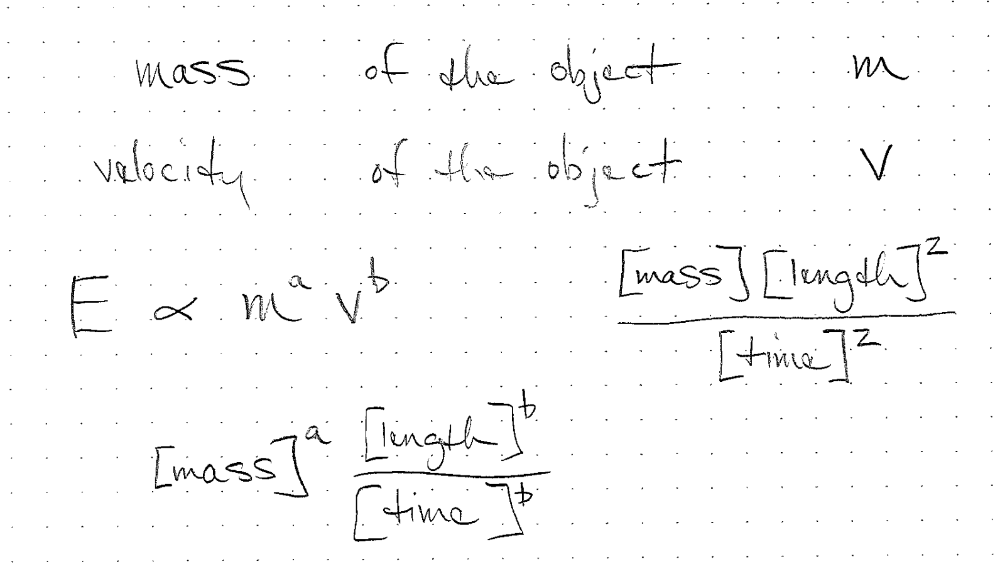

# Quantities

When we use mathematics to model the physical world, we need additional
tools to represent physical quantities.  A number only gives a
magnitude.  When we combine that number with a unit (length, mass) it
becomes a quantity that can represent something physical.

## Dimensions, units, quantities
- A quantity represents a physical measurement like mass, length or
    amount of energy
- We represent a quantity with a number and a unit
- The dimension of a quantity is different than the unit
- For example 1 inch is the same as 2.54 centimeters even though 1 and
    2.54 are not the same number

## Physical Quantities
- Our numbers are often helping us represent physical quantities
- Examples:
    - The length of a tree
    - The number of animals observed
    - The number of molecules of mercury in a fish
- A physical quantity is expressed as the product of a unit and a
  numerical factor

## Dimensions
- These physical quantities often have a dimension
- Examples:
    - Length
    - Time
    - Mass

In our estimations, we may have quantities that are not in fundamental
units such as length or time.  For example, we may be counting a
population of animals, or the number of power plants needed.

<!-- physics have 7 primary dimensions, we may have others -->

## Units
- To quantify dimensions, we use units
- One dimension may have multiple units
- Length: inches, miles, kilometers, light-years
- Mass: grams, pounds, kilograms
- There are also systems of units like SI or English

<!-- what are some units and some unusual units -->
<!-- clicks, bytes, click velocity -->

## Measurement
- Each measurement we make is an estimation of the physical quantity

## Consequences
- NASA Mars Climate Orbiter destroyed because of newton vs pounds of
force
- A cargo flight was lost in 1999 when crew confused meters and feet

## Unit conversion factors
- These factors are equivalent to one or unity and are dimensionless
- They are not numerically equal to one in most cases.
- Units can be crossed out

## Unit conversion factors
- These factors are equivalent to one or unity and are dimensionless
- They are not numerically equal to one in most cases.
- Units can be crossed out
- They can have units but be dimensionless

## Unit conversion factors

These two quantities are equal.

$$ 3 \textrm{feet} = 1 \textrm{yard} $$

If we divide both sides by 3 feet, we get

$$ 1 = \frac{1\ \textrm{yard}}{3\ \textrm{feet}}  $$

Note that this quantity has units of yard per feet, but has no
dimensions since it is a length divided by a length.  If you multiply a
quantity of feet by this, you won't change the quantity but you will
change the units.

## Two units in the denominator
- Births per capita per year
- Hours per week per unit

## Combinations of units
- We often combine units to express new quantities

<!-- can you think of a derived unit? -->

## Student density
- Students per acre
- Number per area
- Spans two orders of magnitude

## Example: Units of students per acre
- [Cal State densities](https://twitter.com/calpolypomona/status/431937140457349120/photo/1)

## Dimensional analysis example
We can use the dimensions of the relevant quantities to deduce the form
of an equation

<!-- what are some units and some unusual units -->
<!-- clicks, bytes, click velocity -->

